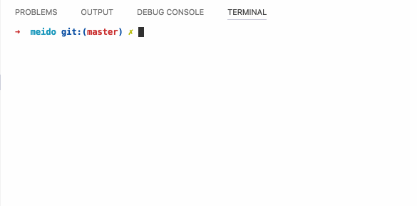

## MEIDO -- Single / Multi file debugger

now support: .js .jsx .vue

## install

```bash

$ npm install meido babel-cli  -g

```


## usage

```bash
// load single file:
$ meido {{ your-dir }}/example.js
meido> :js.example.add 100 200 300 400
1000

// load all the files in the dir:
$ meido {{ your-dir }}


// also can such:
$ meido
meido> :load {{ you-dir }}

```

```js
// {{ your-dir }}/example.js

export default {
  name: "example",
  help:`
    Used to example

    Function:

      js.example.foo             example

      :js.example.hello          example
      :js.example.add [...args]  example   

    `,

  start: (meido) => {
  },

  foo: "bar",
  hello: () => {
    return 'world'
  },
  add: (meido, ...args) => {
    return args.reduce((a,b) => parseInt(a) + parseInt(b))
  }
}


```


## api

```js
help // print help

:q  // quit
:load {{ ...args }}  //load dir/file

```


## demo

