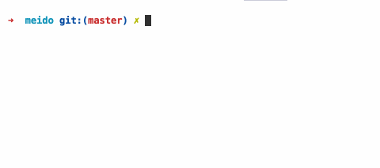

## MEIDO -- Single / Multi file debugger

now support: .js .jsx .vue

## install

```bash

$ npm install meido babel-cli  -g

```


## quick start

```js

$ meido


:example  // load example file

:js.notifier.notify foo bar

:js.example.add 100 200 300 400 500

:ter meido // open a new terminal with meido

help // get help 

:q // quit

```


## usage

```js

// load single file:

$ meido {{ your-dir }}/example.js

meido> :js.example.add 100 200 300 400

> 1000

// load all the files in the dir:

$ meido {{ your-dir }}

```

```js
// also can such:

$ meido

meido> :load {{ you-dir }}

```


## example

```js
// {{ your-dir }}/example.js

export default {
  name: "example",
  help:`
    Used to example

    Function:

      js.example.foo             example

      :js.example.hello          example
      :js.example.add [...args]  example   

    `,

  start: (meido) => {
  },

  foo: "bar",
  hello: () => {
    return 'world'
  },
  add: (meido, ...args) => {
    return args.reduce((a,b) => parseInt(a) + parseInt(b))
  }
}

```


## api

```js
help // print help

:q                              // quit
:load [...paths]                // load dir/file
:example                     // load example file
:ter [bin-name]             // open termial
:setPath [name] [path]     // set the path of the permanent
:getPaths                 // list the path of the all
:removePath [name]       // remove the path 

```


## demo

